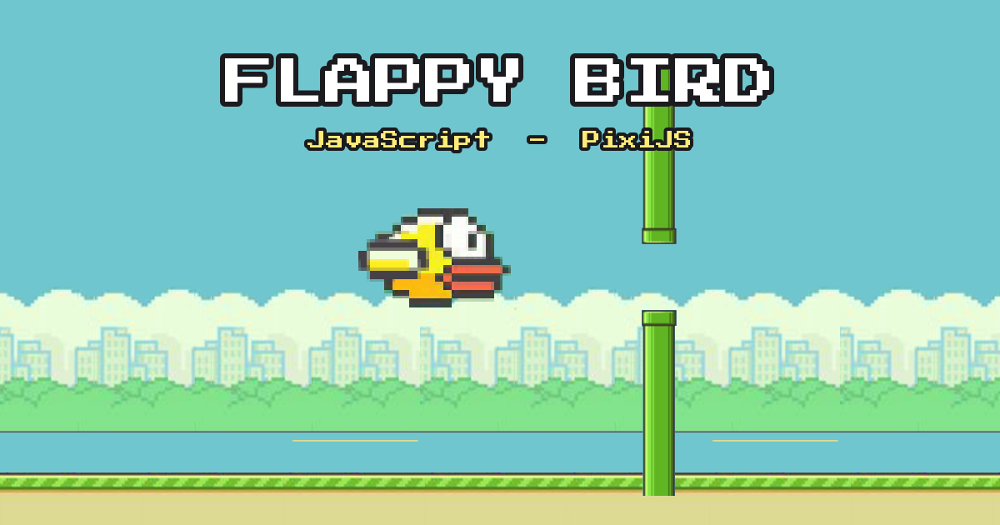

# 🐦 Flappy Bird

> Clone de Flappy Bird en **JavaScript vanilla** et **PixiJS** — TD de Programmation Orientée Objet et Événementielle. Projet front-end, **sans build ni dépendance externe**, centré sur la POO.

**▶️ Démo : [flappybird.melinaterrier.fr](https://flappybird.melinaterrier.fr)**



## 🎮 Contrôles

| Touche / geste          | Action                      |
| ----------------------- | --------------------------- |
| **Espace** / clic / tap | Sauter / démarrer / rejouer |
| **P** ou **Échap**      | Pause                       |

## ✨ Fonctionnalités

- Flux continu de tuyaux, une seule vie, l'oiseau tombe à la mort
- Démarrage doux puis vitesse de croisière, compte à rebours **3·2·1**
- **Meilleur score** persistant (`localStorage`), **médailles** (bronze → platine) et badge « NEW! »
- **Sons** synthétisés en **Web Audio** (saut, point, collision, game over) — aucun fichier audio
- Flash d'impact, **pop** du score, **parallaxe** du décor
- Police pixel *Press Start 2P*, **canvas responsive**, support tactile

## 🚀 Lancer en local

PixiJS (`vendor/`) et la police (`assets/fonts/`) sont **auto-hébergés** — le jeu tourne hors-ligne.
Le code étant en **modules ES**, il faut le servir en HTTP (l'ouvrir en `file://` ne marche pas) :

```bash
python3 -m http.server 8000
# puis http://localhost:8000
```

## 🛠️ Stack technique

- **JavaScript** en modules ES — aucun bundler, aucune étape de build
- **PixiJS 5** (rendu WebGL 2) — auto-hébergé, zéro CDN
- **Web Audio API** pour les sons, synthétisés à la volée
- Compression, cache et en-têtes de sécurité via `.htaccess` (Apache / OVH)

## 📁 Architecture (modules ES)

```
.
├── index.html              # Page + PixiJS (auto-hébergé) + police pixel
├── .htaccess               # Compression, cache, en-têtes de sécurité (prod)
├── vendor/pixi.min.js      # PixiJS auto-hébergé (pas de CDN)
├── js/
│   ├── main.js             # Bootstrap : charge la police puis lance Game
│   ├── config.js           # CONFIG : toutes les constantes du jeu
│   ├── utils.js            # aabbIntersect (collision AABB)
│   ├── entity.js           # Entity : classe de base (sprite, position)
│   ├── bird.js             # Bird  extends Entity — physique de l'oiseau
│   ├── pipe.js             # Pipe  extends Entity — un tuyau + hitboxes
│   ├── pipeManager.js      # PipeManager — flux continu, recyclage, comptage
│   ├── input.js            # InputManager — clavier + souris + tactile
│   ├── sound.js            # SoundManager — effets Web Audio synthétisés
│   ├── hud.js              # HUD — score, get ready, game over, pause, médailles
│   ├── states.js           # Pattern State : Ready / Countdown / Playing / Paused / GameOver
│   └── game.js             # Game — orchestrateur (scène, entités, boucle)
└── assets/
    ├── flappy_bird.png     # Spritesheet
    ├── flappy_bird.json    # Atlas TexturePacker
    ├── og-image.png        # Aperçu réseaux sociaux
    ├── favicon.svg
    └── fonts/              # Police « Press Start 2P » auto-hébergée
```

### Notions POO illustrées
- **Héritage** : `Bird` et `Pipe` héritent de `Entity`.
- **Responsabilité unique** : `PipeManager`, `InputManager`, `HUD`, `SoundManager` ont chacun un rôle clair.
- **Pattern State** : chaque phase du jeu est une classe avec `enter` / `update` / `exit` ; `Game` délègue à l'état courant.
- **Encapsulation** : toutes les constantes centralisées dans `CONFIG`.

## 📄 À propos

Projet pédagogique réalisé dans le cadre d'un cursus d'intégration / développement web.
*Flappy Bird* est une création de Dong Nguyen ; ce clone est strictement éducatif et non commercial.

---

**Mélina Terrier** — [melinaterrier.fr](https://www.melinaterrier.fr)
